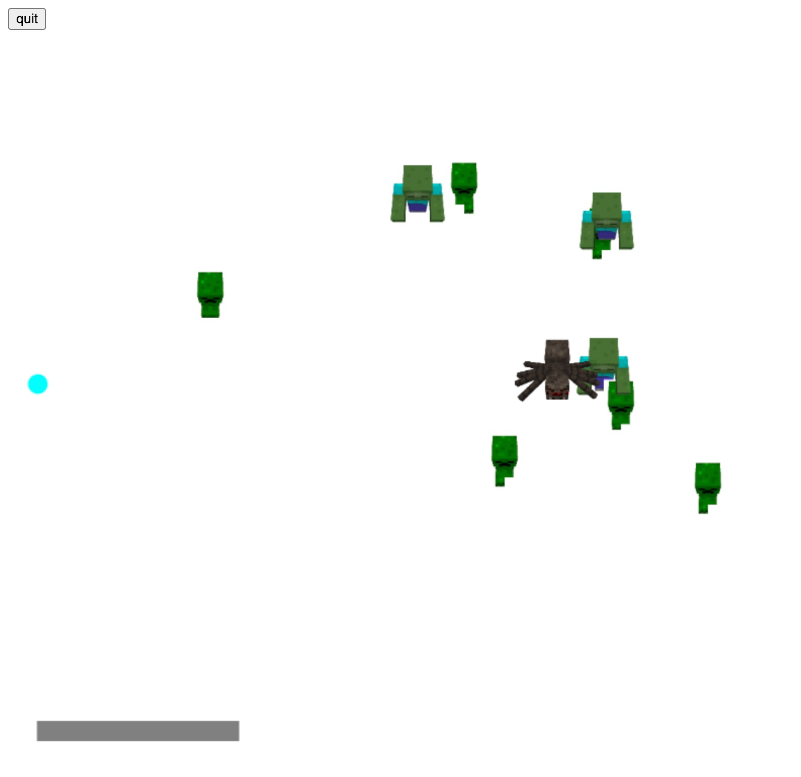

<h2>스테이지3 1차</h2>

스테이지3에 대한 코드를 stage3.js에 작성했습니다. 코드가 아직은 겹치는 부분이 있어서 index.html에서 script src를 js/game_sample.js 에서 js/stage3.js 로 바꿔야 작동합니다.

정상적으로 실행될 경우 이렇게 보여집니다.

일단은 미완성이라 공을 OP(?)로 만들고 콘솔.로그는 지우지 않았습니다. 방식은 회의에서처럼 좀비, 거미, 크리퍼가 위에서 스폰되고 아래로 내려옵니다. 아래에는 주민 마을을 추가할 계획인데, 몹이 아래로 끝까지 내려오면 마을이 데미지를 입고 패배할 수 있습니다.(아직 구현하지 않음)

시간이 되는대로 완성도를 높일 예정입니다.

<h3>추가 구현 계획:</h3>
<ul>
<li>배경
<li>시간(밤에서 낮)
<li>난이도 차이
<li>승패
<li>...
</ul>
