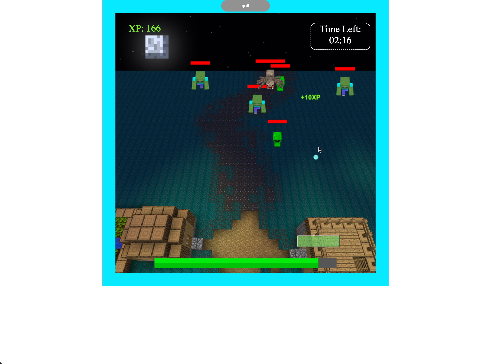
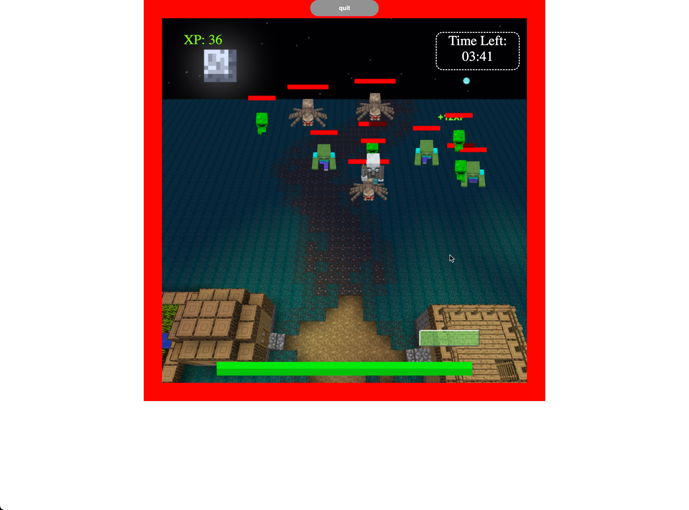
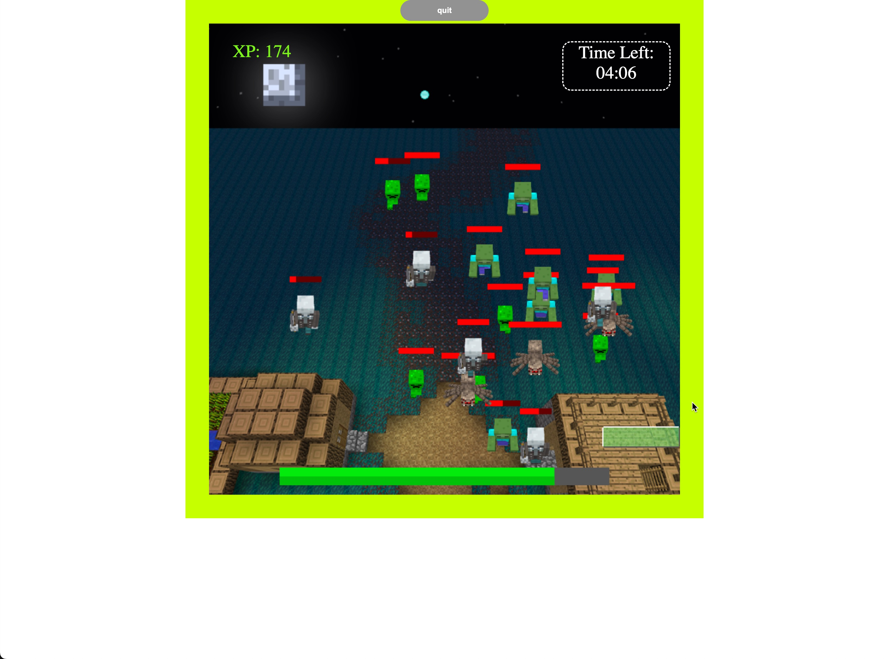
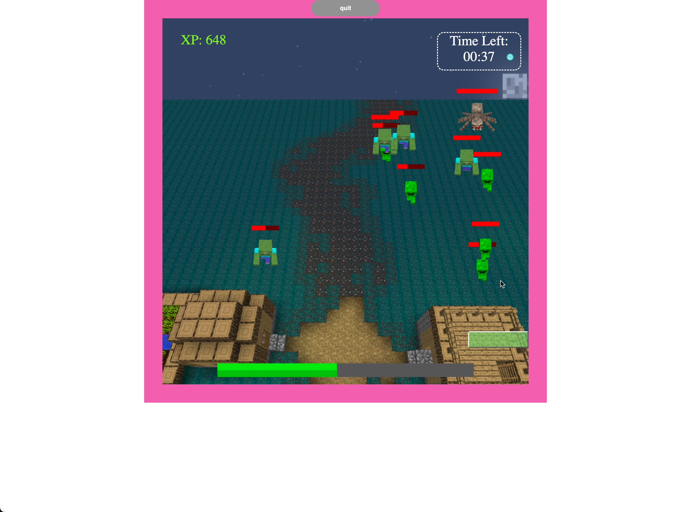
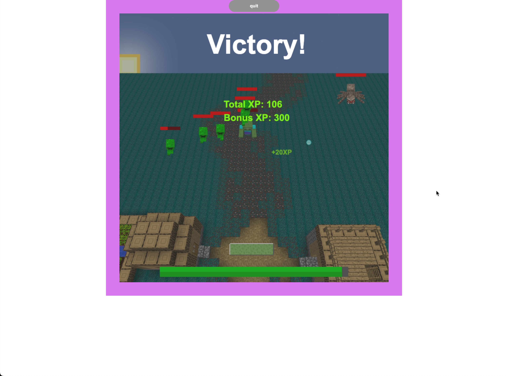

# 스테이지3 4차

스테이지3에 대한 코드를 stage3.js에 작성했습니다. 제 branch의 모든 파일을 다운로드(클론)해야 게임이 정상적으로 동작합니다.

제 branch의 CHANGELOG.md를 참고하시면 어떤 요소가 바뀌었는지 보실 수 있습니다.

먼저 stage 3을 누르면 난이도 선택 알림창이 뜨는데, 1, 2, 3 중 하나를 입력하시면 됩니다. 1은 easy, 2는 normal, 3은 hard입니다. 난이도가 높을 수록 더 많은 몬스터가 나오고, 버텨야 되는 시간이 더 길고, 우민(변명자)도 출현합니다.

<h3>Easy</h3>

<h3>Normal</h3>

<h3>Hard</h3>

시간이 지나면 뒷 배경도 바뀌는 모습을 볼 수 있습니다.

만약 주어진 시간을 모두 버티면 승리 화면이 아래와 같이 나옵니다. 얻은 총 경험치와 승리 보상인 보너스 경험치를 볼 수 있습니다.

그러나 몬스터가 먼저 마을을 부수면 패배합니다. (공이 아래로 내려가도 마을 체력이 줄어듭니다)

시간이 되는대로 완성도를 높일 예정입니다.

<h3>추가 구현 계획:</h3>
<ul>
<li>난이도 ui 개선</li>
<li>스테이지 간 공유 데이터(공 공격력, 크기, 경험치 등)</li>
<li>버그 수정 등</li>
<li>...</li>
</ul>
